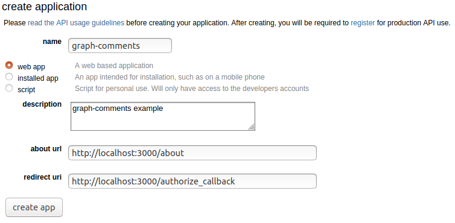

# Overview
I wrote this prototype because I wanted to explore two things
1. graphs being used as the structure for comments. The tree style of comments that I've experieneced in user interfaces always leaves something to be desired. They are typically clunky to navigate with a lot of scrolling, expanding, and collapsing. It is also hard to separate the wheat from the chaff, one word responses to topics use up a lot of UI real estate.
1. I wanted to experiment with svelte.dev for the user experience

# Goals
I was to hoping to achieve some things with this effort
1. Easy to navigate comments by swiping or arrow keys
1. Filtering => Remove comments based on criteria
1. Ordering => Newest comments, Longest Comments, Most upvoted

# Reddit API

I choose to integrate with the Reddit API because they have a lot of comments in the typical tree structure and generating sample data didn't seem like much fun. I wanted to apply my idea against a real dataset. Reddit did do a nice job with its API. It is fairly straightforward to use. This tricky bit is getting OAuth configured. I opted to do the token exchange manually instead of using a library. 

*Reddit API*
* https://www.reddit.com/dev/api/
* https://www.reddit.com/prefs/apps (Configure your application here)
* https://github.com/reddit-archive/reddit/wiki/API
* https://github.com/reddit-archive/reddit/wiki/OAuth2

*Usage*
You'll need to configure a .env with a the client_id and secret from https://www.reddit.com/prefs/apps with type 'web app'



Use the values from the application and add them to a new local file at the root the project '.env'. The project will load these values to connect to the reddit API.
```
REDDIT_AGENT=javascript/svelte graph-comments test (by /u/<YOUR REDDIT USERNAME>)
REDDIT_CLIENT_ID=<extract from Reddit Application>
REDDIT_CLIENT_SECRET=<extract from Reddit Application>
```

# Setup and Environment
*Versions*
```
$ node --version
v12.16.3
$ npm --version
6.14.5
```
To fun this application yourself you'll need to setup your own account in reddit as an application developer.

*Start the app*
```
npm run dev
```

## Debugging
I'm new to developing in Node.js and I followed some breadcrumbs to attach a debugger: 
* https://stackoverflow.com/questions/59143965/debug-sapper-server-side
* https://itnext.io/the-absolute-easiest-way-to-debug-node-js-with-vscode-2e02ef5b1bad
```
npm run debug_server
```

# Access the app
* Find an article http://localhost:3000/r/programming/top
  * You can substitute any subreddit
* Navigate the comments
  * Double click | Swipe Right | Right Arrow => drill into this comment for more details
  * Swipe Left | Left Arrow => Previous State